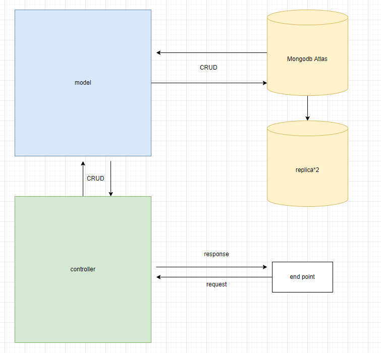
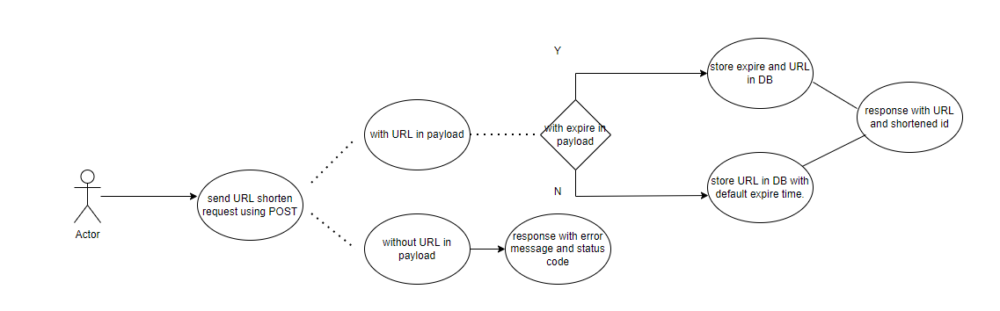
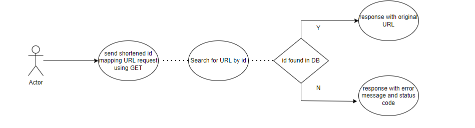

# url shortener
## To run this backend application(Note that you need a Mongo URI in .env file):

``` nodejs
npm i && npm run dev
```
## to run unit testing:
``` nodejs
npm test
```
## system archetechture
### This project can be separated by:
    1. index.js: The entry of the project.
    2. config: Define system config like connect to DB.
    3. routes: Define REST API routes.
    4. controllers: Define how to handle the requests.
    5. model: Define schema.
    6. middlewares: Define middlewares like Error handler.
    7. test: define test cases.
### system archetechture graph


## use case
1. /api/v1/urls

2. /:id


## dependencies
    "axios": simulate endpoint users.
    "compression": compress request in order to handle high traffic.
    "dotenv": use .env file to store credential like Mongo URI.
    "express": Handle request
    "express-async-handler": Syntax sugar for implementing async middleware.
    "mongoose": mongoDB atlas provide multi granularity locking to handle cocurrency request and replica set to ensure data durability.
    "valid-url": To ensure URL in payload is valid.