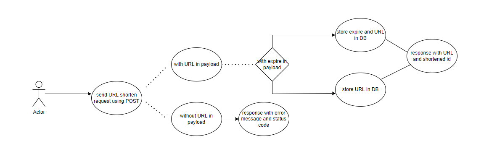

# url shortener
## To run this backend application:

``` nodejs
npm i && npm run dev
```
## to run unit testing:
``` nodejs
npm test
```
## system archetechture


## use case
### /api/v1/urls

### /:id
